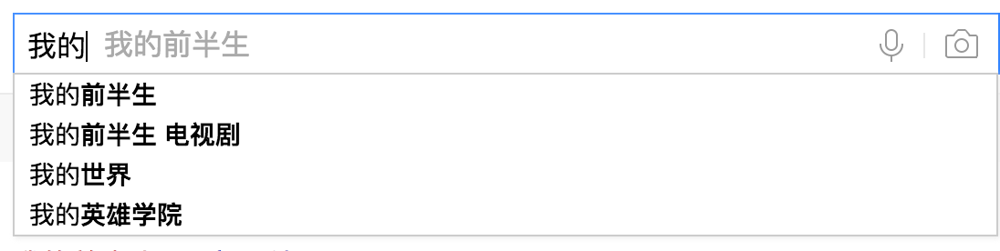

# 仿百度的自动下拉搜索框



## JSONP跨域请求数据

组件的核心是数据的获取，也就是说当用户输入一些词汇的时候，你怎么去找到那些联想词。其实百度提供一个官方接口`http://www.baidu.com/su?&wd='`。如果是用 ajax 去调用的，除非设置了 CORS ，否则根据同源策略就无法获取数据，所以 jsonp 是个很好的办法。

## 优化

* 页面重绘回流优化

原理很简单，就是在JS中创建一个新ul，并且把li添加进去，最后把新ul和旧ul进行替换。把多次回流合并成一次。

```js
var ulList = document.getElementsByTagName('ul')[0];
var newUlist = document.createElement('ul');

// data是跨域请求的结果
data.s.forEach(function (item) {
    var li = document.createElement('li');
    li.textContent = item;
    newUlist.appendChild(li);
})

document.getElementsByTagName('div')[0].replaceChild(newUlist, ulList);
```

* 事件代理

使用事件代理，在ul中绑定click事件，减少了事件注册，节省了内存占用，大大提高了性能。同时，能够让每个动态添加的li都能绑定事件。

```js
EventUtil.addHandler(newUlist, 'click', function (event) {
    var e = event || window.event;
    var target = e.target || e.srcElement;
    if (target.tagName.toLowerCase() === "li") {
        var wd = target.innerHTML;
        window.open('https://www.baidu.com/s?word=' + wd);
    }
});
```


